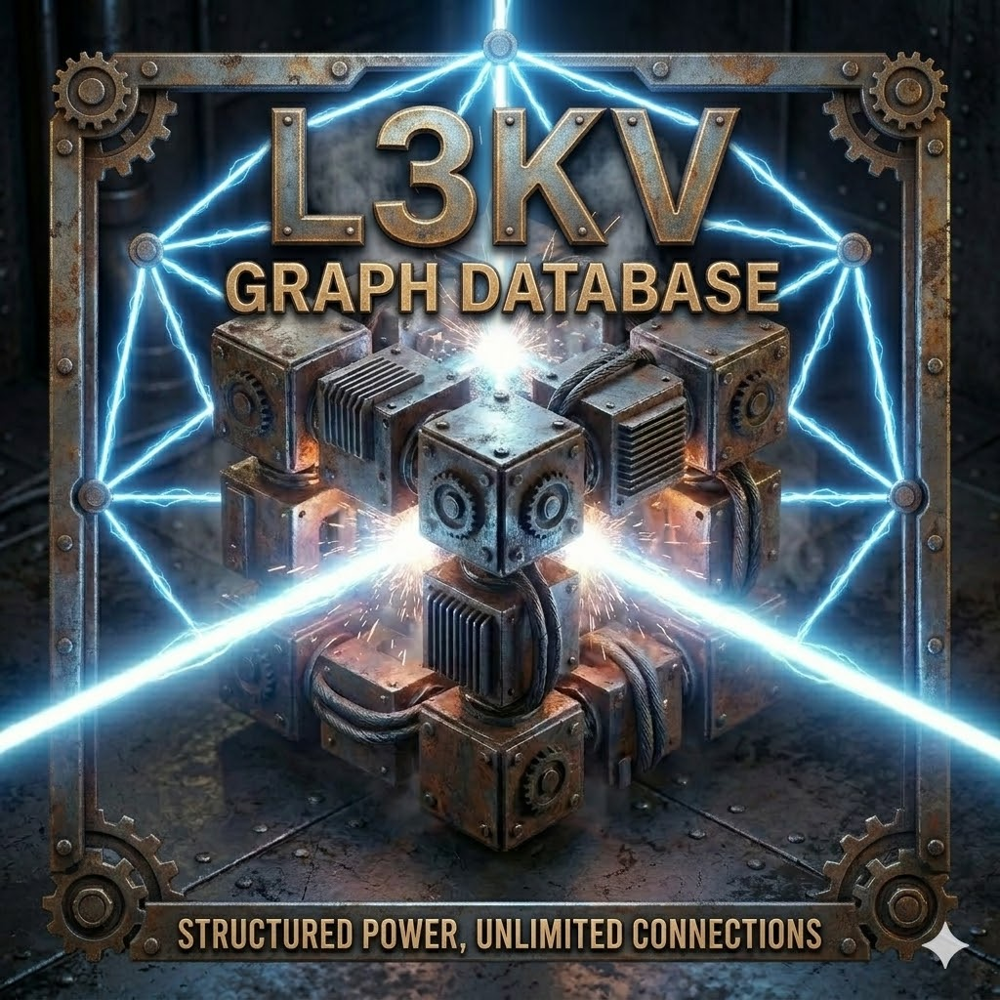

<p align="center">
  
</p>

# L3KVG: High-Performance Embedded Graph Engine

L3KVG is a C++20 embedded property graph engine built directly on top of the **L3KV** actor-model key-value store, leveraging **lite3-cpp** for zero-copy native BSON-like JSON document resolution over PMR (Polymorphic Memory Resources).

## Features

- **Embedded & Network-Free:** No serialized network round-trips. Direct pointer-local traversals isolated completely to the host process.
- **Fluent C++ API:** A Cypher-inspired fluent builder API natively available directly in C++.
- **Zero-Copy Attributes:** Node and Edge properties are represented as `lite3::Buffer` views, enforcing lazy evaluation. Attributes are only dynamically allocated and resolved exactly when projected.
- **Lock-Free Concurrency:** Fully concurrent multi-threaded architecture leveraging L3KV's internal 64-way sharded actor-model message queues, bypassing global serialization locks.
- **Horizontal Scaling**: Native support for sharded graph distribution across a cluster using consistent hashing and HLC-synchronized distributed writes.
- **SRE-First Observability**: Built-in metrics engine with dedicated React-based visualizer for tracking topology and performance.

## Horizontal Scaling & Distribution

L3KVG Evolution 2 transitions the engine from local-only to a distributed graph fabric:

- **Cluster Mapping**: Utilizes `ConsistentHash` to deterministically shard nodes across physical peers.
- **Transparent RPC**: `RemoteL3KVClient` automatically forwards property lookups and neighbor traversals to the owner node via high-performance ZeroMQ (ZMQ_DEALER/ROUTER).
- **Atomic Edge Coordination**: The `EdgeCoordinator` implements a dual-shard write protocol with Hybrid Logical Clocks (HLC), ensuring causal consistency for edges spanning multiple physical nodes.
- **Auto-Routing**: `Engine::put_node` automatically routes write operations to the correct shard owner in the cluster.
- **Structured Edge Metadata**: Evolutionary support for rich property objects on edges, maintained with HLC consistency and stored in zero-copy BSON buffers.

## Edge Properties & Structured Metadata

L3KVG Evolution 3 introduces support for structured edge metadata. Each edge can now carry a full JSON payload. User-defined properties are automatically nested under a `props` key to separate them from system metadata (e.g., timestamps):

- **Atomic Hydration**: Edge properties are hydrated automatically from the distributed store during `get_edges()` calls.
- **Type-Safe Access**: Retrieve properties using the `get_attribute<T>(key)` template method on the `Edge` object.
- **Zero-Collision Mapping**: The engine ensures that user properties do not overwrite system-level telemetry like the logical clock.

## Architecture & Performance

To meet strict SRE guidelines (sub-500µs single hop traversal, >10,000 ops/sec writing), L3KVG implements the following foundational patterns:

- **Redis-style Hash Tagging (`{id}`)**: By embedding routing tags directly in edge keys (e.g. `e:out:{uuid}:label:weight:dst`), all outbound and inbound edges form contiguous edge blocks residing strictly on the **same hardware thread/shard** as their parent graph node.
- **Actor-Model Routines**: `add_edge` and adjacency traversals encapsulate execution closures and pass them to bounded underlying core routines. This removes the necessity of thread-unsafe maps, achieving safe parallel traversal isolation.
- **ZeroMQ Asynchronous Pipeline**: Leverages L3KV's April 2026 ZeroMQ upgrade, achieving **~97,000** concurrent edge additions/sec across a 3-node cluster.

- **Spin-Lock De-jitter**: By inserting spin-cycles preceding task yielding upon empty queues, L3KVG bypasses OS-level thread rescheduling penalties (~1-15ms Windows Jitter).

## API Example

```cpp
#include "L3KVG/Engine.hpp"

// Initialize Graph Engine bounds
auto engine = std::make_unique<l3kvg::Engine>("db_path_test", 1);

// Add Nodes
engine->put_node("npc_1", R"({"name": "Thief", "type": "npc"})");
engine->put_node("npc_2", R"({"name": "Guard", "type": "npc"})");

// Link Edges with properties
engine->add_edge("npc_1", "knows", 1.0, "npc_2", R"({"since": 2021, "status": "allied"})");

// Fluent Traversal Pipeline
auto results = engine->query()
    .match("npc_1")
    .where_eq("type", "npc")
    .out("knows")
    .return_({"name"})
    .execute();

// Direct Attribute Access
auto edges = node->get_edges("knows", l3kvg::Direction::OUT);
for (auto& edge : edges) {
    int year = edge->get_attribute<int>("since");
    std::string status = edge->get_attribute<std::string>("status");
}
```

## SRE Metrics Dashboard & Native Cypher Graph

The L3KVG Engine includes an embedded C++ `httplib` server serving directly over internal memory spaces tracking engine cache retention algorithms and parsing Cypher AST topologies. 

**Running the SRE Visualizer:**

1. **Start the API Server:**
   ```bash
   cmake --build build --config Release --target l3kvg_server
   ./build/Release/l3kvg_server.exe
   ```
2. **Start the React Visualizer:**
   ```bash
   cd dashboard
   npm install
   npm run dev
   ```
   Navigate to `http://localhost:5173`. The application leverages Google Material Design 3 UI and strict D3 mapping algorithms to plot Cypher queries (`/api/query`) visibly directly out of the L3KV Graph Engine embedded runtime.

## Production Readiness & Deployment

### Deployment Strategy
L3KVG is designed for **Shared-Nothing Architecture**. To deploy a cluster:
1. **Configure Peers**: Seed the `ClusterResolver` with the IP/Port of all participating nodes.
2. **Persistence**: Ensure each node has a dedicated NVMe path for the L3KV WAL (`node.wal`).
3. **Networking**: Open ports for the Internal API (default: 8080) for cross-shard edge coordination.

### Production Audit Status
| Feature | Status | Notes |
| :--- | :--- | :--- |
| **Consistency** | ✅ HLC Synced | Causal consistency across shards. |
| **Persistence** | ✅ L3KV WAL | Crash-safe with zero-data-loss durability. |
| **Performance** | ✅ Zero-Copy | Sub-500µs local traversals. |
| **Security** | ⚠️ Needs Proxy | No built-in TLS/Auth. Use Nginx/mTLS. |
| **Availability** | ✅ AP Sharding | Self-healing via Active Anti-Entropy (AAE). |

Detailed API documentation is available in [API.md](file:///c:/Users/jason/playground/L3KVG/API.md).
