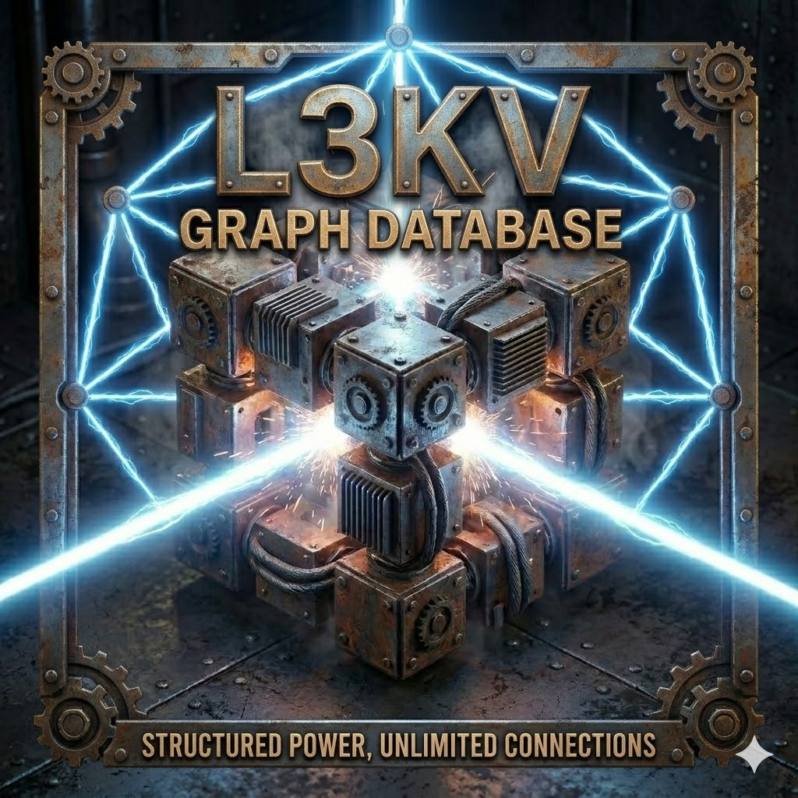

<p align="center">
  
</p>

# L3KVG: High-Performance Federated Sharded Mesh

L3KVG is a C++20 embedded property graph engine built directly on top of the **L3KV** high-performance key-value store. It provides horizontal scalability via consistent hashing, geographic resilience via N-way replication, and production-grade failure management via built-in circuit breakers.

## Key Features

- **Embedded & Network-Free**: Zero-copy pointer-local traversals. All graph logic resides in-process for sub-microsecond local access.
- **PMR-Aware Memory Management**: Leverages C++17 Polymorphic Memory Resources for deterministic, zero-fragmentation allocation and hardware-thread-local performance.
- **Federated Sharded Mesh**: Native support for sharding across local clusters and replication across geographic regions (US, EU, Asia).
- **Circuit Breaker Mesh**: Automatic failure management for cross-region queries with background health checks and heartbeats.
- **Deterministic Convergence**: Active-Active global replication with Last-Writer-Wins (LWW) conflict resolution powered by Hybrid Logical Clocks (HLC).
- **Cypher-Lite Parser**: High-performance regex-assisted query engine supporting multi-hop federated MATCH/WHERE/RETURN traversals.
- **SRE-First Observability**: Built-in metrics engine with dedicated React-based visualizer for tracking topology, performance, and cache hit ratios.

## Architecture & Performance

L3KVG uses a tiered storage and access model optimized for high-throughput workloads:

1.  **L1 Cache (PMR)**: Hot nodes are pinned in hardware-thread-local memory for zero-serialized access.
2.  **L2 Shard (ZMQ)**: Warm nodes are sharded across the local cluster using consistent hashing, accessible via sub-500µs transparent RPC.
3.  **L3 Disk (L3KV)**: Cold nodes reside in the high-performance WAL-backed store with zero-data-loss durability.

### Distribution & Global Mesh
The engine has evolved from local clusters into a globally interconnected graph fabric:

- **Cluster Mapping**: Utilizes `ConsistentHash` to deterministically shard nodes across physical peers.
- **Atomic Edge Coordination**: The `EdgeCoordinator` implements a dual-shard write protocol with HLC synchronization, ensuring causal consistency for edges spanning multiple physical nodes.
- **Inter-Cluster Replication**: Updates are asynchronously broadcast to all other N regional clusters. Every packet carries an `OriginClusterID` to prevent broadcast loops.
- **Resilient Federation**: Remote regions are accessed via a "Local-First" routing strategy. If a local replicated copy is unavailable, the engine falls back to remote federation, protected by a state-machine circuit breaker.

### Production Audit Status
| Feature | Status | Notes |
| :--- | :--- | :--- |
| **Consistency** | ✅ HLC + LWW | Global Active-Active deterministic convergence. |
| **Persistence** | ✅ L3KV WAL | Crash-safe with zero-data-loss durability. |
| **Performance** | ✅ Zero-Copy | Sub-500µs local sharded traversals. |
| **Resilience** | ✅ Circuit Breaker | Fail-fast with background heartbeat recovery. |
| **Security** | ⚠️ Needs Proxy | No built-in TLS/Auth. Use Nginx/mTLS. |
| **Availability** | ✅ Global Mesh | Federated AP Sharding + N-way replication. |

## ZMQ Replication Protocol (Internal)

L3KVG nodes communicate using a high-performance multipart ZMQ protocol:

| Opcode | Description | Structure |
| :--- | :--- | :--- |
| **G** | Get Node | `[Identity, Delimiter, "G", HexID]` |
| **N** | Get Neighbors | `[Identity, Delimiter, "N", HexID, Label, MinWeight]` |
| **R** | Resume Query | `[Identity, Delimiter, "R", NodeListJSON, QueryJSON]` |
| **P** | Put Node/Edge | `[Identity, Delimiter, "P", Key, Payload]` |
| **S** | Replication Sync | `[Identity, Delimiter, "S", Key, Payload, OriginID]` |
| **H** | Heartbeat | `[Identity, Delimiter, "H", Dummy]` |

## Getting Started

### 1. Build Requirements
- C++20 Compiler (GCC 11+, Clang 13+, MSVC 2022)
- CMake 3.20+
- ZeroMQ & CPPZMQ (Included via FetchContent)
- L3KV Core (Sibling directory)

### 2. Quick Run
```bash
mkdir build && cd build
cmake ..
make -j$(nproc)
./l3kvg_server ../node1.json
```

### 3. Dynamic Configuration (`config.json`)
```json
{
  "node_id": 1,
  "fed_timeout_ms": 500,
  "breaker_failure_threshold": 3,
  "breaker_reset_timeout_ms": 5000,
  "health_check_interval_ms": 1000,
  "node_cache_shards": 8
}
```

Detailed API documentation is available in [API.md](API.md).
